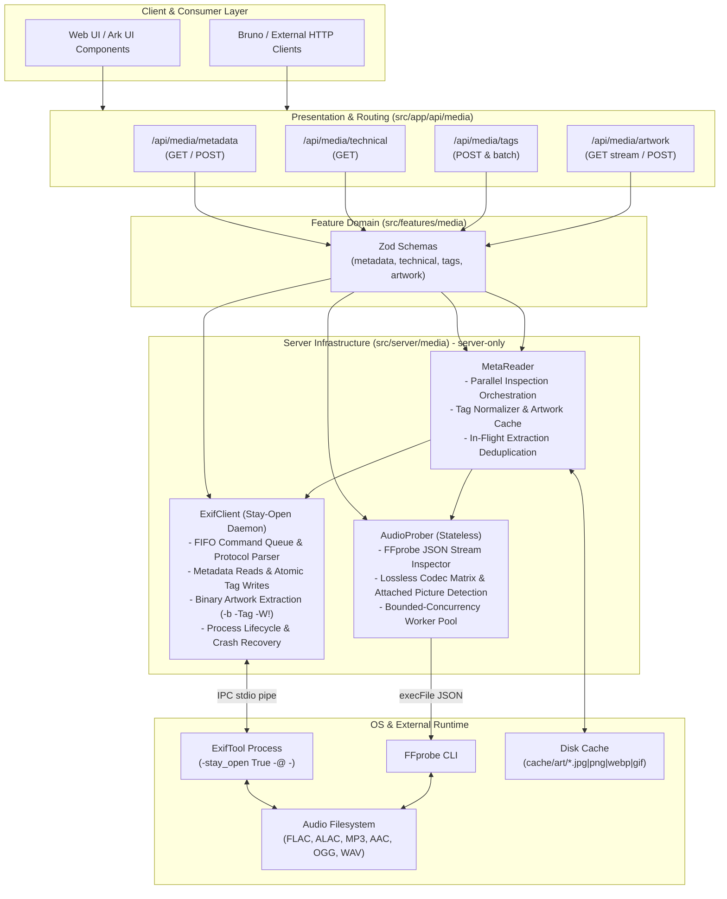
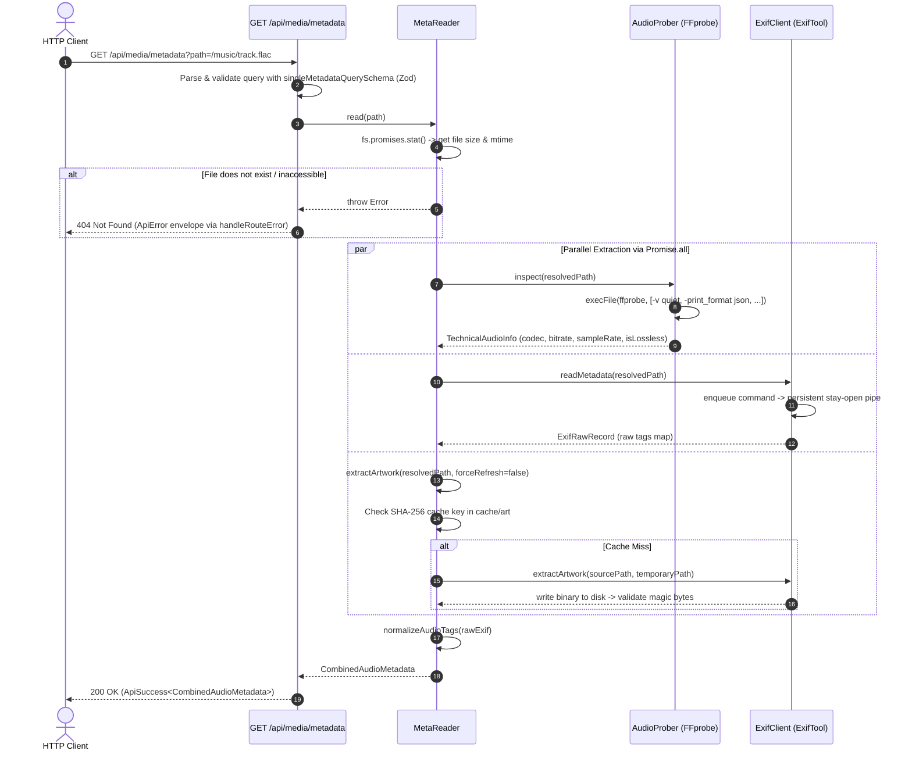
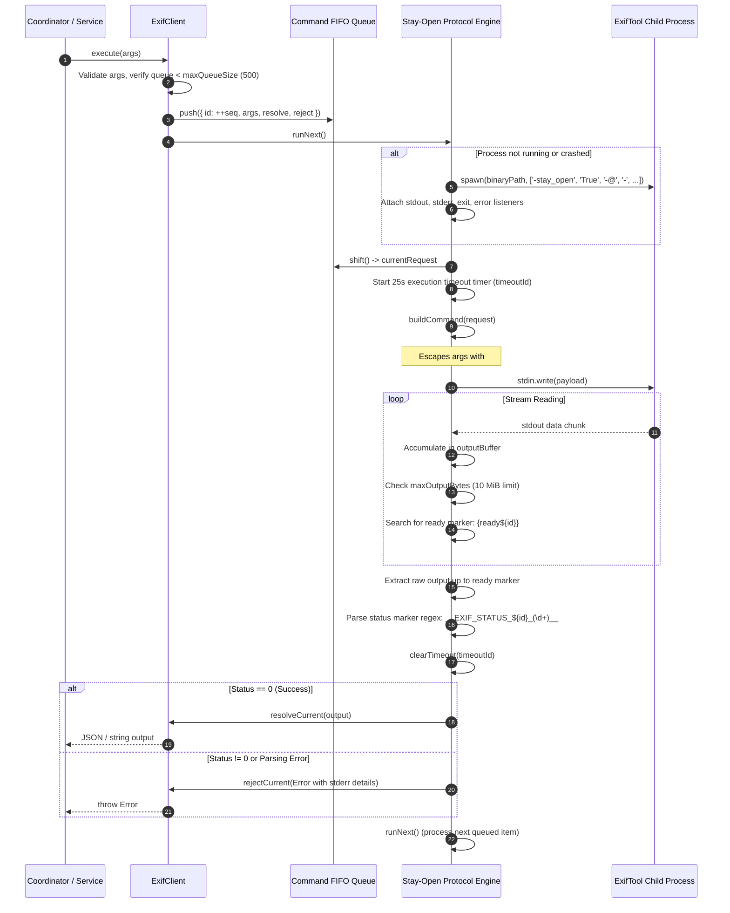
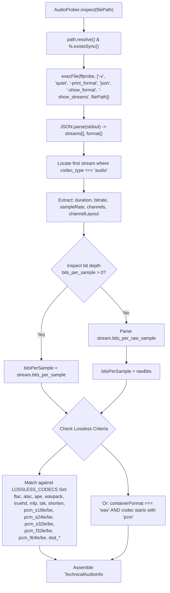
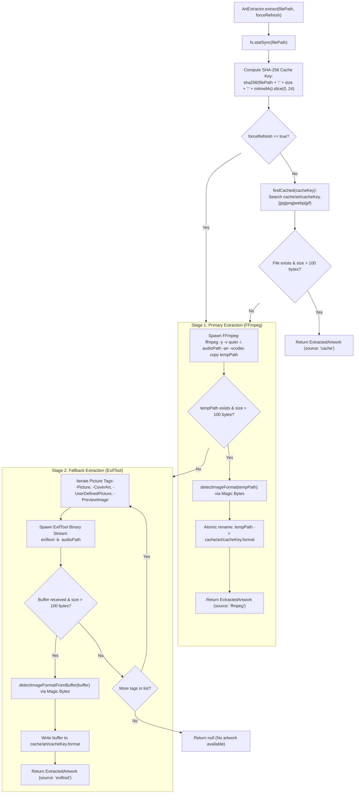
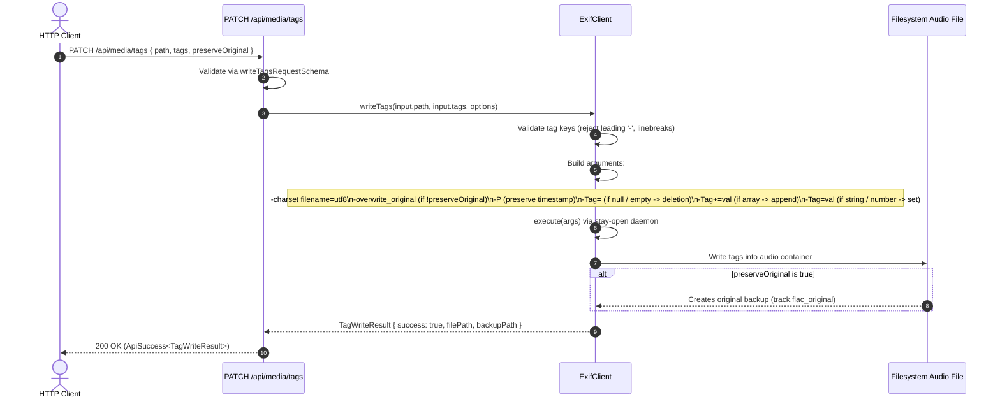

# My Music

A modern, high-performance web audio library and music metadata manager built with Next.js 16 (App Router), TypeScript, Ark UI, Tailwind CSS v4, ExifTool, FFmpeg, and FFprobe.

---

## Architecture & System Overview

- **Persistent ExifTool Subsystem**: Executes a persistent ExifTool process using `-stay_open True -@ -` to eliminate Perl startup overhead, cutting command latency from ~250ms to ~15ms with full queue serialization, process crash recovery, and batch processing.
- **FFprobe Audio Engine**: Extracts deep audio technical specifications (codec, container, exact duration, sample rate, channels, bit rate, bits per sample, and mathematical lossless detection).
- **Artwork Extraction & Stream Cache**: Uses FFmpeg direct stream extraction with automatic fallback to ExifTool binary tags, deterministically caching album covers under `cache/art` and serving them via HTTP binary streaming with aggressive caching headers.
- **Strict Server/Client Boundary**: Server infrastructure is strictly guarded with `server-only`. Environment configuration is validated at startup via Zod in `src/config/env.server.ts`.
- **Unified API Standard**: All API endpoints return a typed `ApiResponse<T>` envelope with standardized HTTP status codes and machine-readable error codes.

---

## Prerequisites & Installation

### 1. System Requirements

Ensure the following tools are installed and accessible in your system `PATH` (or configure their absolute paths in `.env`):

- **Node.js**: v20 or newer
- **ExifTool**: [exiftool.org](https://exiftool.org/) (e.g., `exiftool` on PATH or `C:\ExifTool\exiftool.exe`)
- **FFmpeg & FFprobe**: [ffmpeg.org](https://ffmpeg.org/) (e.g., `ffmpeg` and `ffprobe` on PATH or `C:\ffmpeg\bin\*.exe`)

### 2. Install Project Dependencies

```bash
npm install
```

### 3. Environment Configuration

Copy the example environment file and customize your configuration if needed:

```bash
cp .env.example .env
```

| Variable | Default | Description |
| :--- | :--- | :--- |
| `NODE_ENV` | `development` | Runtime environment (`development`, `production`, `test`) |
| `PORT` | `3000` | Port for the Next.js HTTP server |
| `EXIFTOOL_PATH` | `exiftool` | Path or binary name for ExifTool CLI |
| `FFMPEG_PATH` | `ffmpeg` | Path or binary name for FFmpeg CLI |
| `FFPROBE_PATH` | `ffprobe` | Path or binary name for FFprobe CLI |
| `ART_CACHE_DIR` | `cache/art` | Directory for caching extracted album artwork |

---

## Media Subsystem Execution Flow & Architecture

The media subsystem (`src/server/media` and `src/features/media`) is the core engine of the application. It handles audio metadata extraction, deep stream inspection, high-performance tag editing, and album artwork extraction with deterministic caching. It coordinates three underlying CLI binary tools (**ExifTool**, **FFmpeg**, and **FFprobe**) through a resilient multi-layered pipeline.

### Architectural Layering & Boundaries



---

### Detailed Component Roles & Internal State

| Component | Location | Primary Responsibilities & Design Patterns |
| :--- | :--- | :--- |
| **`MetaReader`** | `src/server/media/meta/reader.ts` | **Multi-Source Orchestrator**: Executes `AudioProber` and `ExifClient` concurrently via `Promise.all`. Normalizes conflicting tags into unified `AudioTags`. Manages disk artwork caching (`cache/art`), in-flight extraction request deduplication, and magic-byte format validation. |
| **`ExifClient`** | `src/server/media/exif/client.ts` | **Persistent Process Daemon**: Maintains a single long-lived ExifTool process using `-stay_open True -@ -`. Eliminates ~235ms Perl startup overhead per call. Implements FIFO command queue, atomic tag writing with optional backups, crash auto-recovery, and direct binary artwork extraction (`-b -Tag -W!`). |
| **`AudioProber`** | `src/server/media/ffprobe/reader.ts` | **Stream Specification Engine**: Direct-instantiation client that executes `ffprobe` to extract audio technical metrics. Evaluates audio streams against lossless codecs, checks bit depth, sample rates, duration, attached-picture disposition, and provides bounded concurrency worker pools. |

---

### 1. Unified Metadata Inspection Execution Flow

The primary read flow orchestrates `FFprobe` and `ExifTool` concurrently to return a rich `CombinedAudioMetadata` object.



#### Tag Normalization Logic (`normalizeAudioTags`)
Heterogeneous audio formats store metadata under differing container tags. The normalizer evaluates priorities:
- **Title / Artist / Album**: Scans `ID3:Title` → `Vorbis:TITLE` → `QuickTime:Title` → `RIFF:Title`.
- **Artists Array**: Maps `artist` and multiple values if found.
- **Genre Multi-Values**: Splits string entries on delimiter patterns `[,;/]` and flattens arrays into normalized `string[]`.
- **Track & Disc Numbers**: Parses composite `"4/12"` strings into numeric `trackNumber: 4` and `trackTotal: 12`. Falls back to standalone `TrackTotal` or `TotalTracks`.
- **Date & Year**: Extracts 4-digit years using regex `/\b(19\d\d|20\d\d)\b/` across `RecordingTime`, `ReleaseDate`, and `Year`.
- **ReplayGain**: Normalizes `TrackGain`, `TrackPeak`, `AlbumGain`, and `AlbumPeak`.

---

### 2. High-Performance ExifTool Stay-Open Subsystem

To overcome the heavy Perl startup cost (~250ms per CLI invocation), `ExifClient` uses ExifTool's native daemon mode (`-stay_open True -@ -`). Commands run in ~15ms.



#### Protocol Framing & Guardrails
- **C-String Argument Escaping**: All arguments are prepended with `#[CSTR]` and escaped (`\` → `\\`, `\r` → `\r`, `\n` → `\n`, `\t` → `\t`). Null bytes (`\0`) are strictly rejected.
- **Delimiter Tracking**: The client monitors stdout for the unique string `{ready${id}}`. Output before this delimiter is extracted, and remainder bytes stay in the buffer.
- **Return Code Extraction**: ExifTool echoes `-echo3 __EXIF_STATUS_${id}_${status}__`. The status code is verified: `0` is success; non-zero throws with captured `stderr` context.
- **Command Timeout**: Active commands are limited to 25 seconds (`DEFAULT_TIMEOUT_MS`). The timer only starts when the command leaves the queue and reaches `stdin`.
- **Buffer Safety**: If `outputBytes > 10 MiB`, the process is immediately killed (`SIGKILL`), reset, and the request is rejected to protect against out-of-memory crashes.
- **Batch Chunking & Error Isolation**: When reading hundreds of files (`readBatch`), requests are chunked in groups of 40 (`chunkSize = 40`). If a chunk fails (e.g. one corrupted audio header causes ExifTool to exit), the client catches the failure and automatically retries each file in that chunk individually, ensuring healthy files are never lost.

---

### 3. Technical Audio Inspection & Mathematical Lossless Verification

`AudioProber` interfaces with `ffprobe` to pull exact technical specifications and verify codec integrity.



#### Lossless Codecs Registry
Mathematical lossless verification is performed against the `LOSSLESS_CODECS` set:
- **PCM**: `pcm_s16le`, `pcm_s16be`, `pcm_s24le`, `pcm_s24be`, `pcm_s32le`, `pcm_s32be`, `pcm_f32le`, `pcm_f32be`, `pcm_f64le`, `pcm_f64be`.
- **High-Resolution Containers**: `flac`, `alac`, `ape`, `wavpack`, `truehd`, `mlp`, `tak`, `shorten`.
- **Direct Stream Digital (DSD)**: `dsd_lsbf`, `dsd_msbf`, `dsd_lsbf_planar`, `dsd_msbf_planar`.
- **WAV Streams**: Any WAV container packaging PCM audio.

---

### 4. Dual-Stage Album Artwork Extraction & Caching Pipeline

`ArtExtractor` deterministically identifies, extracts, verifies, and caches album artwork.



#### Magic Byte Sniffing Matrix
Extracted binary payloads are checked at the byte level before writing to disk, avoiding corrupt or misnamed images:
- **JPEG**: `0xFF 0xD8 0xFF`
- **PNG**: `0x89 0x50 0x4E 0x47` (`\x89PNG`)
- **WebP**: `0x52 0x49 0x46 0x46` (`RIFF`) at offset 0, and `0x57 0x45 0x42 0x50` (`WEBP`) at offset 8
- **GIF**: `0x47 0x49 0x46` (`GIF`)

#### HTTP Binary Streaming & Caching
When a client requests `GET /api/media/artwork?file=<filename>`:
1. `MetaReader.findArtwork()` runs `path.basename(file)` to strictly eliminate path traversal attacks (`../`).
2. Checks `cache/art/<filename>` on disk.
3. Streams the binary payload via web `ReadableStream` with production caching headers:
   ```http
   HTTP/1.1 200 OK
   Content-Type: image/jpeg
   Content-Length: 124580
   Cache-Control: public, max-age=31536000, immutable
   Content-Disposition: inline; filename="a1b2c3d4e5f6.jpg"
   ```

---

### 5. Metadata Tag Writing Execution Flow

When updating or deleting metadata (`PATCH /api/media/tags` or `PATCH /api/media/tags/batch`), operations pass through strict tag sanitization:



---

### 6. High-Throughput Batch Processing Flows

For large music libraries, the media subsystem uses distinct concurrency mechanisms tailored to each tool's architecture:

```mermaid
flowchart TD
    subgraph BatchMeta["Batch Metadata Read (POST /api/media/metadata/batch)"]
        FileList["File Paths List [1..N]"] --> Split["Split Execution into 2 Concurrent Branches"]
        
        Split --> BranchExif["Branch 1: ExifTool Batch Reader"]
        Split --> BranchProbe["Branch 2: FFprobe Worker Pool"]

        subgraph ExifChunking["ExifTool Native Multi-File Chunking"]
            BranchExif --> Chunk40["Slice into chunks of 40 files"]
            Chunk40 --> ExecChunk["execute(['-j', ...40Paths])"]
            ExecChunk --> ChunkOk{"Chunk succeeds?"}
            ChunkOk -->|Yes| ParseExif["Map records by SourceFile"]
            ChunkOk -->|No| Retry1["Fallback: Retry each of the 40 files individually"]
            Retry1 --> ParseExif
        end

        subgraph ProbePool["FFprobe Bounded Concurrency Pool"]
            BranchProbe --> Workers["Spawn 8 Concurrent Workers\n(concurrency = 8)"]
            Workers --> QueueLoop["Iterate atomic shared index:\nnextIndex++ < totalFiles"]
            QueueLoop --> ExecProbe["AudioProber.inspect(file)"]
            ExecProbe --> MapProbe["Map TechnicalAudioInfo by resolvedPath"]
        end

        ParseExif --> Join["Promise.all joins both maps"]
        MapProbe --> Join
        Join --> ArtLoop["Iterate files -> Non-blocking ArtExtractor.extract()"]
        ArtLoop --> StatFiles["fs.statSync() & normalizeAudioTags()"]
        StatFiles --> ReturnBatch["Return BatchMetadataResponse { total, results }"]
    end
```



---

### 7. Failure Recovery, Resilience & Lifecycle Matrix

| Failure Mode | Detection Point | Recovery & Mitigation Strategy | Resulting Client Response |
| :--- | :--- | :--- | :--- |
| **File Not Found** | `MediaService` (`fs.existsSync`) | Immediate short-circuit before spawning child processes or queuing jobs. | `404 Not Found` (`NotFoundError`) |
| **Corrupted Audio Header** | `FFprobe` parser | Process returns non-zero error. Caught in worker loop; logs warning and skips file during batch scan. | In single: `500 Internal Server Error`; In batch: omitted from results. |
| **ExifTool Daemon Crash** | `childProcess.once('exit')` | Process handle is cleared (`toolProcess = null`). Any active request is rejected. Subsequent command triggers automatic respawn. | Active request fails; subsequent requests automatically reinitialize daemon. |
| **ExifTool Command Timeout** | 25-second active execution timer | Process is forcefully killed (`SIGKILL`), buffers cleared, current request rejected, and next queued command runs. | `500 Internal Server Error` with timeout message. |
| **Stdout Buffer Overflow** | Buffer byte counter > 10 MiB | Process is immediately killed (`SIGKILL`), output discarded, preventing Node.js heap exhaustion. | `500 Internal Server Error` (`ExifTool output exceeded limit`). |
| **Corrupted File in Batch** | `ExifClient.readBatch()` | If a 40-file batch fails, client intercepts failure and retries all 40 files individually. | The 39 valid files succeed; only the corrupt file is skipped. |
| **No Embedded Artwork** | `ArtExtractor` | Dual-stage pipeline fails gracefully (FFmpeg temp file empty, ExifTool returns null buffer). | `404 Not Found` on artwork API; `artwork: null` on metadata inspect. |
| **Path Traversal Attack** | `MediaService.getArtworkBinary` | Applies `path.basename(query.file)`, locking access to `cache/art` folder. | Safely resolves file or returns `404 Not Found`. |
| **Process Termination / Shutdown** | Node `process.on('exit')` | Registered exit hook issues `-stay_open False\n` with a 2-second fallback timer before sending `SIGKILL`. | Clean process exit with no orphaned background daemons. |

---

## API Reference

All JSON endpoints adhere to the project `ApiResponse<T>` envelope standard:

```ts
// Success Response
{
  "success": true,
  "data": T,
  "message": "Optional human-readable confirmation",
  "meta": { "timestamp": "ISO-8601" }
}

// Error Response
{
  "success": false,
  "error": {
    "code": "VALIDATION_ERROR" | "BAD_REQUEST" | "NOT_FOUND" | "INTERNAL_SERVER_ERROR",
    "message": "Human-readable description",
    "details": [...] // Structured validation issues or debug context
  }
}
```

---

### 1. Audio Metadata APIs

#### `GET /api/media/metadata`
Inspects unified metadata for a single audio file (merging ExifTool tags, FFprobe technical specs, and artwork presence).

- **Query Parameters**:
  - `path` (string, required): Full filesystem path to the target audio file.

- **Example Request**:
  ```http
  GET /api/media/metadata?path=E:/Music/Artist/Album/01-Track.flac HTTP/1.1
  ```

- **Example Response (200 OK)**:
  ```json
  {
    "success": true,
    "data": {
      "filePath": "E:/Music/Artist/Album/01-Track.flac",
      "fileSizeBytes": 45129384,
      "lastModified": "2026-03-15T14:30:00.000Z",
      "tags": {
        "title": "Song Title",
        "artist": "Artist Name",
        "album": "Album Title",
        "genre": ["Alternative", "Rock"],
        "year": 2024,
        "trackNumber": 1,
        "trackTotal": 12
      },
      "technical": {
        "codec": "flac",
        "codecLongName": "FLAC (Free Lossless Audio Codec)",
        "containerFormat": "flac",
        "duration": 245.8,
        "bitrate": 1411200,
        "sampleRate": 44100,
        "channels": 2,
        "channelLayout": "stereo",
        "bitsPerSample": 24,
        "isLossless": true
      },
      "artwork": {
        "cachedPath": "E:/Code/Next/my-music/cache/art/a1b2c3d4e5f6.jpg",
        "filename": "a1b2c3d4e5f6.jpg",
        "mimeType": "image/jpeg",
        "sizeBytes": 124580,
        "source": "ffmpeg"
      }
    }
  }
  ```

---

#### `POST /api/media/metadata/batch` (or `POST /api/media/metadata`)
Performs concurrent batch metadata extraction across multiple audio files.

- **Request Body**:
  ```json
  {
    "paths": [
      "E:/Music/Album/01.mp3",
      "E:/Music/Album/02.mp3"
    ]
  }
  ```

- **Example Response (200 OK)**:
  ```json
  {
    "success": true,
    "data": {
      "total": 2,
      "results": {
        "E:/Music/Album/01.mp3": { /* CombinedAudioMetadata */ },
        "E:/Music/Album/02.mp3": { /* CombinedAudioMetadata */ }
      }
    },
    "message": "Processed metadata inspection for 2 files"
  }
  ```

---

### 2. Technical Audio Specifications API

#### `GET /api/media/technical`
Retrieves in-depth stream and container format metrics via FFprobe.

- **Query Parameters**:
  - `path` (string, required): Full filesystem path to the audio file.

- **Example Request**:
  ```http
  GET /api/media/technical?path=E:/Music/Track.flac HTTP/1.1
  ```

- **Example Response (200 OK)**:
  ```json
  {
    "success": true,
    "data": {
      "codec": "flac",
      "codecLongName": "FLAC (Free Lossless Audio Codec)",
      "containerFormat": "flac",
      "containerLongName": "raw FLAC",
      "duration": 218.44,
      "bitrate": 984000,
      "sampleRate": 48000,
      "channels": 2,
      "channelLayout": "stereo",
      "bitsPerSample": 24,
      "isLossless": true,
      "streamCount": 1
    }
  }
  ```

---

### 3. Metadata Tag Writing APIs

#### `POST /api/media/tags`
Writes or modifies metadata tags in a single audio file using persistent ExifTool. Setting a tag to `null` or `""` deletes it.

- **Request Body**:
  ```json
  {
    "path": "E:/Music/Track.mp3",
    "tags": {
      "Title": "Updated Title",
      "Artist": "New Artist",
      "Album": "Special Edition",
      "Year": 2026,
      "Genre": ["Electronic", "Ambient"],
      "Comment": null
    },
    "preserveOriginal": false
  }
  ```

- **Parameters**:
  - `path` (string, required): Audio file path.
  - `tags` (object, required): Key-value pairs of tag names and values (`string`, `number`, `string[]`, or `null`).
  - `preserveOriginal` (boolean, optional, default: `false`): If `true`, saves the pre-modified file as `filename.ext_original`.

- **Example Response (200 OK)**:
  ```json
  {
    "success": true,
    "data": {
      "success": true,
      "filePath": "E:/Music/Track.mp3",
      "updatedTags": {
        "Title": "Updated Title",
        "Artist": "New Artist",
        "Album": "Special Edition",
        "Year": 2026,
        "Genre": ["Electronic", "Ambient"],
        "Comment": null
      },
      "preserveOriginal": false
    },
    "message": "Tags written successfully for \"E:/Music/Track.mp3\""
  }
  ```

---

#### `POST /api/media/tags/batch`
Writes tags to multiple files in a single batch operation.

- **Request Body**:
  ```json
  {
    "targets": [
      {
        "path": "E:/Music/01.mp3",
        "tags": { "Artist": "Band Name", "Album": "Album Title" }
      },
      {
        "path": "E:/Music/02.mp3",
        "tags": { "Artist": "Band Name", "Album": "Album Title" }
      }
    ],
    "preserveOriginal": false
  }
  ```

- **Example Response (200 OK)**:
  ```json
  {
    "success": true,
    "data": {
      "total": 2,
      "succeeded": [ /* TagWriteResult[] */ ],
      "failed": []
    },
    "message": "Batch tag write complete: 2 succeeded, 0 failed"
  }
  ```

---

### 4. Album Artwork APIs

#### `GET /api/media/artwork`
Direct binary stream of album artwork for embedding in UI `` elements.

- **Query Parameters** (at least one required):
  - `file` (string): Cached artwork filename (e.g. `a1b2c3d4e5f6.jpg`). Path traversal is strictly prevented.
  - `path` (string): Full audio file path. Artwork is extracted on-the-fly and cached if not already present.

- **Response Headers**:
  - `Content-Type`: `image/jpeg` / `image/png` / `image/webp`
  - `Cache-Control`: `public, max-age=31536000, immutable`
  - `Content-Disposition`: `inline; filename="<filename>"`

- **Status Codes**:
  - `200 OK`: Binary image data.
  - `404 Not Found`: No embedded art available.

---

#### `POST /api/media/artwork`
Extracts embedded artwork from an audio file, persists it into `cache/art`, and returns JSON metadata.

- **Request Body**:
  ```json
  {
    "path": "E:/Music/Song.flac",
    "forceRefresh": false
  }
  ```

- **Example Response (200 OK)**:
  ```json
  {
    "success": true,
    "data": {
      "cachedPath": "E:/Code/Next/my-music/cache/art/9c8b7a6f5e4d.jpg",
      "filename": "9c8b7a6f5e4d.jpg",
      "mimeType": "image/jpeg",
      "sizeBytes": 204890,
      "source": "ffmpeg"
    },
    "message": "Artwork extracted successfully"
  }
  ```

---

### 5. Library Scanner API

#### `POST /api/scan`
Initiates a background audio library scan of a directory.

- **Request Body**:
  ```json
  {
    "directory": "E:/Music",
    "scanMode": "addNew",
    "recursive": true
  }
  ```

- **Parameters**:
  - `directory` (string, required): Target folder to scan.
  - `scanMode` (`"addNew"` | `"forceAll"` | `"rescanErrors"`, default: `"addNew"`).
  - `recursive` (boolean, default: `true`).

- **Example Response (202 Accepted)**:
  ```json
  {
    "success": true,
    "data": {
      "scanId": "scan_1727625000000_abc123",
      "directory": "E:/Music",
      "scanMode": "addNew",
      "recursive": true,
      "timestamp": "2026-09-29T15:50:00.000Z"
    },
    "message": "Library scan initiated successfully for \"E:/Music\""
  }
  ```

---

## Bruno API Collection

The repository includes a complete [Bruno](https://www.usebruno.com/) API collection located under [`bruno/`](file:///e:/Code/Next/my-music/bruno/) containing 29 requests covering every endpoint with happy paths, validation errors, and assertions.

### Opening the Collection in Bruno:
1. Open the **Bruno** desktop application.
2. Click **Open Collection** and select the [`bruno/`](file:///e:/Code/Next/my-music/bruno/) folder in this repository.
3. Select the **Local** environment (`{{baseUrl}} = http://localhost:3000`).
4. Execute individual requests or run the entire test suite.

---

## Development Scripts

```bash
# Run Next.js local development server (with Turbopack)
npm run dev

# Run production build and verify TypeScript types
npm run build

# Run ESLint validation
npm run lint

# Format codebase via Prettier
npm run format
```

---

## License

MIT
